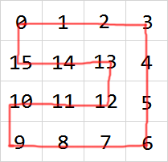

Click on the image above to view a live build of this project.

This project was created with react, and it features the classic computer game snake.

The user has the ability to choose game speed, various modifiers that build on the original game, and even watch an AI attempt to win the game.

The AI isn't ML based (sorry to disappoint), but instead uses a cost function to determine the snake's next move. This cost function is dependent on a hamiltonian cycle (a path from the first square, back to itself, that touches every square on the board exactly once).

As you can see above, a super easy way to win snake every time is to just follow a hamiltonian cycle until you eventually run into your tail, but what's the fun in that.

My algorithm works by first checking whether a certain move (straight, turn left, or turn right) will doom the snake. Doom, meaning that if the snake were to follow the hamiltonian cycle after that move, it would eventually run into itself.

If there's at least one path that won't doom the snake, the algorithm chooses to go into the direction that will get it "closest" (assuming that after the move, the snake follows the hamiltonian cycle) to the snake.

If every move dooms the snake, it follows the hamiltonian cycle.

This project was bootstrapped with [Create React App](https://github.com/facebook/create-react-app).

This project was enspired by the youtuber CodeBullet but shares no code / direct replication.
